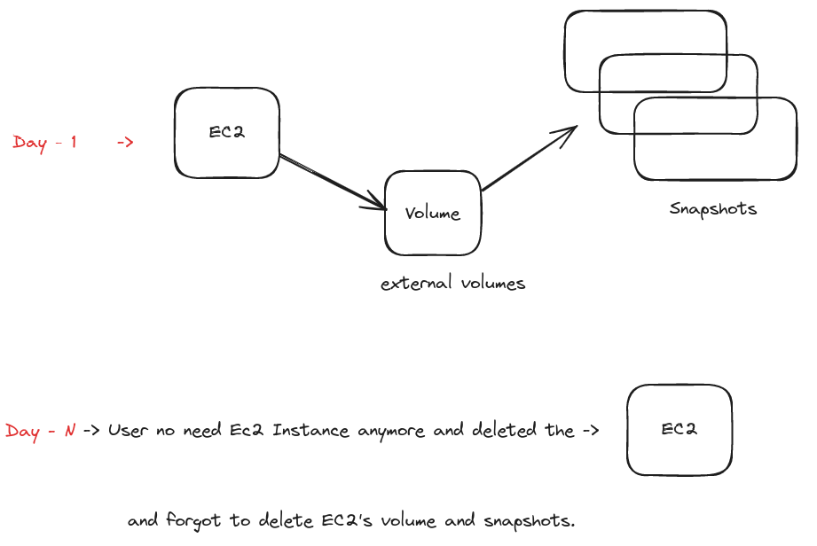

- Backup of volume -> Snapshot


- Extra costs you may face if you're not careful:

  - S3 buckets: Unused or forgotten buckets with data can add up in cost.

  - EKS clusters: Unused test clusters left running will charge for control plane and nodes.

  - Stale resources: Unused volumes, snapshots, or IPs can silently increase your bill.


-  Run cleanup script
  - ```python cost-opt-ebs-stale-snapshots.py```

- Verify if any unused resources remain
  - List unattached EBS volumes
    - ```aws ec2 describe-volumes --filters Name=status,Values=available --query "Volumes[*].[VolumeId,Size]" --output table```
  - List your EBS snapshots
    - ```aws ec2 describe-snapshots --owner-ids self --query "Snapshots[*].[SnapshotId,VolumeId,StartTime,State]" --output table```

----------------------
If any stale resources are detected, the DevOps Engineer can receive notifications, such as:

- Hey, I have noticed that you have created an EBS volume, but it is not attached to any EC2 instances.
- Or, you have created a bunch of snapshots that are not attached to any volumes or EC2 instances.

Why don't you delete them?

----------------------

Lambda functions:
 - python (boto3)
 - to talk to AWS API

 - Call Lambda function once a week using CloudWatch.


### Some tools
1. AWS Trusted Advisor 

- It provides recommendations across multiple categories, including cost optimization and security.
- It has free tier which includes basic checks and paid version for the detailed one.


 ### Resources:
 - [AWS Cost Optimization - Abhishek Veeramalla](https://www.youtube.com/watch?v=OKYJCHHSWb4&t=1182s)
 - [AWS Trusted Advisor](https://aws.amazon.com/premiumsupport/technology/trusted-advisor/)
